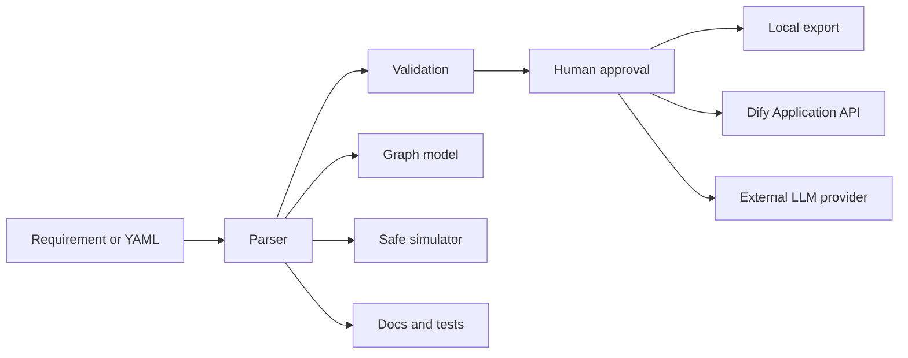

# Architecture

## Design goals

The application is local-first, optional-network, source-derived, testable, and
explicit about the boundary between structural simulation and real Dify
execution.

## Processes and trust boundaries

### Electron main process

Owns capabilities that must not be exposed to web content:

- SQLite lifecycle
- OS credential encryption/decryption
- import/export file dialogs
- protected network calls to a configured Dify Application API
- project and approval persistence

IPC handlers use fixed channel names. The preload exposes methods rather than a
generic `send` primitive. Renderer values are treated as untrusted at every
handler.

### Preload

Runs with context isolation and exposes the typed `DesktopApi`. There is no
Node.js object leakage and no filesystem path primitive.

### Renderer

React owns presentation and workflow coordination. Zustand stores active
workspace state; TanStack Query is available for asynchronous profile/runtime
extensions. Monaco and React Flow consume the same parsed DSL document used by
the validator.

### Pure core

`src/core` has no Electron dependency:

- `dsl`: YAML parsing, formatting, generation, version compatibility
- `validation`: schema/graph/lineage/security/prompt rules
- `graph`: React Flow conversion
- `runner`: bounded safe simulation
- `ai`: provider abstraction and adapters
- `agents`: visible pipeline summaries
- `docs` and `tests-generator`: exportable artifacts
- `security`: recursive redaction

This boundary makes the critical behavior unit-testable in Node.

## Data flow

Hidden chain-of-thought is never displayed. Agent modules expose a plan summary,
findings, confidence, risks, and approvals.

## Storage model

The application uses one SQLite database:

- `projects`: requirement, DSL, docs, tests, timestamps
- `profiles`: public provider settings and encrypted secret blob
- `approvals`: protected action, risk, state, diff, decision timestamps

WAL mode is enabled. Deleting a project also deletes its approval history.

## Build

Vite builds the renderer. tsup compiles main/preload to CommonJS because
Electron loads those entry points directly. `node:sqlite` is loaded through
`process.getBuiltinModule` so bundlers cannot rewrite the built-in specifier.

Electron Builder creates NSIS, DMG, AppImage, and DEB targets.
